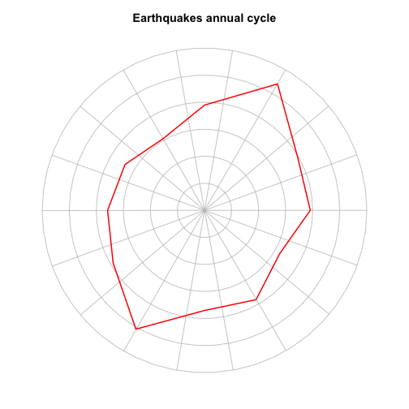

Some options for figures with R
========================================================
author: David Hood
date: 5 May 2015

base plot
========================================================

Baseplot is an additive pen and paper model.

- Add to figure with individual functions
- par() sets pen and paper settings
- May need to write a lot of custom code
- Enough code can do anything

***


 


```r
plot(); points(); lines(); text();
```


lattice
========================================================

Extending R for easy multivariant relationships

- can express groups in formula
- ~ numerical relationship
- | conditional on
- * combinations of

complicated to customise individual panels


***

 


```r
xyplot(magnitude ~ depth | year)
```

ggplot
========================================================
Grammar of Graphics 

- aesthetics (data's role)
- geometry (layers of shapes)
- stats (transformations)
- theme (look)


```r
ggplot(data= censusnorel, aes(x=year, y=prop)) + geom_point( alpha=0.05) + geom_smooth( method="lm")
```

***
 

maps
========================================================
maps & ggmap

- shapes ploted on a latitude and longitude
- plot other things on top
- mapsdata has High Quality NZ outline map


```r
map(); points(); title();
```


***
 

plotrix
========================================================
plotting cycles (also ggplot)

- round grid
- normally tricky to position


```r
polar.plot(ebyM$count, ebyM$month * 30, rp.type="p", lwd=2, line.col="red", xaxt='n', labels="", show.grid.labels=FALSE, radial.lim= c(0,max(ebyM$count)), main="Earthquakes annual cycle")
```


***
 

rgl
========================================================
plotting 3D graphs

- variety of options
- extension of 2D


```r
library(rgl)
plot3d(earthq$latitude, earthq$longitude, earthq$depth, col="#FF000022", box=FALSE, xlab="latitude",  ylab="longitude", zlab="depth")  
rgl.snapshot("rgl.png", fmt="png")
```
***


igraph
========================================================
plotting relationships

- nodes (connection points)
- edges (connecting lines)

```r
G <- graph( sample(1:20, 16, replace=TRUE), directed = FALSE )
plot(G, layout = layout.fruchterman. reingold, edge.width=2)
```
***
 

rgdal
========================================================
Use ESRI shapefiles (GIS)

- GDAL talks to ESRI shapefiles
- rgdal talks to GDAL

so with mapfiles of areas, and data of areas, you can make maps


```r
aubase <- readOGR(...)
#prepare fill cols
plot(mapdata, col= y2013norelmap$fillc)
```
***

 

seewave
========================================================
can plot frequency spectrographs and related data

- includes tuneR data (mp3s etc)


```r
call <- readMP3("tui-song-50.mp3")
spectro(call, f=44100, wl=1024, flim=c(0,5))
```

***

 

vaguely related
========================================================

## rcharts

Turn charts into interactive javascript based charts with embedded data that can be placed on the web

## shiny

Web platform where you can load up a script and user interface, and people can use R via the web through your interface to do the things in the script. This can include displaying charts.

sources
========================================================

NZ recorded crime: [Statistics New Zealand, Infoshare, LTD002AA] (http://www.stats.govt.nz/infoshare/Default.aspx)

NZ population: [Statistics New Zealand, Population Tables, Table 1] (http://www.stats.govt.nz/browse_for_stats/population/estimates_and_projections/historical-population-tables.aspx)

Earthquakes 1974-2014: [Geonet](http://quakesearch.geonet.org.nz)

NZ census: [Statistics New Zealand]( http://www.stats.govt.nz/Census/2013-census/data-tables/meshblock-dataset.aspx)

NZ census shapefiles: [Statistics New Zealand](http://www.stats.govt.nz/browse_for_stats/Maps_and_geography/Geographic-areas/digital-boundary-files.aspx)

Tui call: [Department of Conservation](http://www.doc.govt.nz/nature/native-animals/birds/bird-songs-and-calls/)


